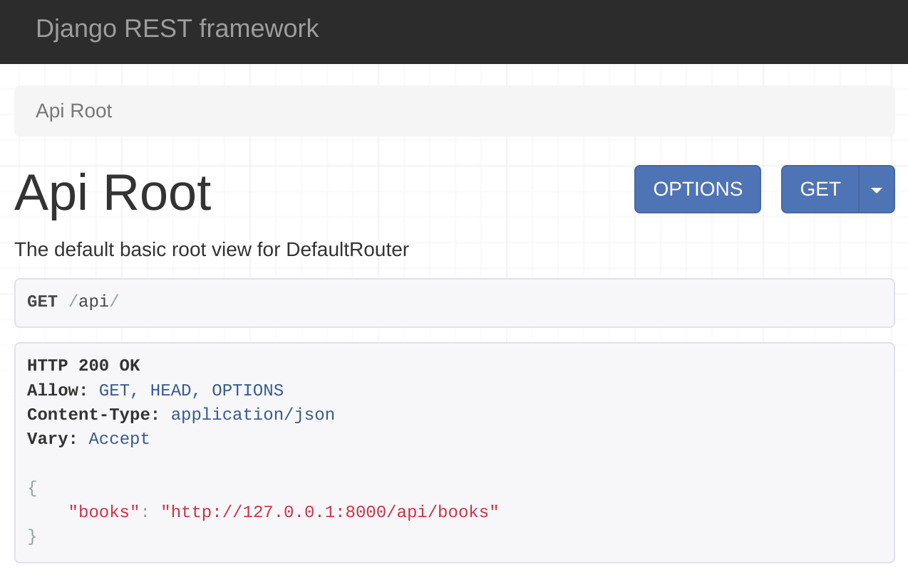

# Diferentes tipos de enrutamiento en DRF

## Introducción

El marco REST de Django proporciona diferentes formas de mapeo o enrutamiento de URL en un proyecto de API. Además del estilo tradicional de enrutamiento, existen otras técnicas de enrutamiento que pueden ahorrarle tiempo durante el desarrollo. En esta lectura, aprenderá sobre técnicas tradicionales y de otro tipo.

>Nota: Todas las rutas deben realizarse en el archivo urls.py en su aplicación Django.

### Rutas regulares
El siguiente código asigna una función de un archivo views.py a un punto final de la API. No olvide que primero debe importar la función de ruta desde el módulo django.urls .

```python 

from django.urls import path
from . import views
urlpatterns = [
	path('books’,views.books) ,
]
```

Este patrón de URL asigna la función de libros al punto final /api/books . Ya sabe cómo especificar qué métodos HTTP puede servir una vista de función proporcionándolos en la función api_decorator . El siguiente código permite que cualquier vista de función sirva métodos HTTP GET y POST .


```python 

@api_view([‘GET’,’POST’])
```

## Enrutamiento a un método de clase

Si asigna un método específico de una clase, primero debe declarar ese método como @staticmethod . Después de eso, puede mapearlo en el archivo urls.py. Aquí hay un ejemplo de una clase en el archivo views.py .

```python
class Orders():
	@staticmethod
	@api_view()
	def listOrders(request):
    	return Response({'message':'list of orders'}, 200)
```

También puede asignar este método listOrders  en el  archivo urls.py  de la siguiente manera.  


```python
from django.urls import path
from . import views
urlpatterns = [
	path('orders', views.Orders.listOrders)
```


##Enrutamiento de vistas basadas en clases

Puede ahorrar mucho tiempo en DRF asignando una clase que amplíe la APIview . No necesita mapear individualmente cada método de dichas clases. En un próximo video, Funciones y vistas basadas en clases, aprenderá que dichas clases tienen métodos específicos de verbos HTTP dentro de ellas. Cuando una clase amplía APIview o vistas genéricas, simplemente puede asignar esas clases en el archivo urls.py.

Aquí está el código de la clase que extiende APIView .

```python
class BookView(APIView):
	def get(self, request, pk):
    	return Response({"message":"single book with id " + str(pk)}, status.HTTP_200_OK)
	def put(self, request, pk):
    	return Response({"title":request.data.get('title')}, status.HTTP_200_OK)
```

Y así es como asigna esta clase en el   archivo urls.py. Todo lo que tiene que hacer es mapear la clase como una vista contra un punto final.  

```python
from django.urls import path
from . import views
urlpatterns = [
    path('books/<int:pk>',views.BookView.as_view())
]
```

Ahora puede realizar llamadas HTTP, GET y PUT al punto final /api/books/{bookId} sin problemas. Si la clase tiene los métodos post() , delete() y patch() , también funcionará con los métodos HTTP POST , DELETE y PATCH 


## Clases de enrutamiento que amplían los conjuntos de vistas

Puede tener clases que amplíen los diferentes tipos de ViewSets en su proyecto API. Al igual que las clases que amplían APIView , estas clases también tienen métodos específicos que se utilizan para responder a diferentes tipos de solicitudes HTTP. Este es un ejemplo de una clase típica que amplía la clase viewset.Viewset .

```python
Class BookView(viewsets.ViewSet):
	def list(self, request):
    	return Response({"message":"All books"}, status.HTTP_200_OK)
	def create(self, request):
    	return Response({"message":"Creating a book"}, status.HTTP_201_CREATED)
	def update(self, request, pk=None):
    	return Response({"message":"Updating a book"}, status.HTTP_200_OK)
	def retrieve(self, request, pk=None):
    	return Response({"message":"Displaying a book"}, status.HTTP_200_OK)
	def partial_update(self, request, pk=None):
        return Response({"message":"Partially updating a book"}, status.HTTP_200_OK)
	def destroy(self, request, pk=None):
    	return Response({"message":"Deleting a book"}, status.HTTP_200_OK)
```


Puede mapear esta clase en el archivo urls.py en su aplicación Django de la siguiente manera.

```python
urlpatterns = [
	path('books', views.BookView.as_view(
    	{
        	'get': 'list',
        	'post': 'create',
    	})
	),
    path('books/<int:pk>',views.BookView.as_view(
    	{
        	'get': 'retrieve',
        	'put': 'update',
        	'patch': 'partial_update',
        	'delete': 'destroy',
    	})
	)
]
```


Observe cómo se asignan los verbos HTTP con cada método en esta clase. Además, tenga en cuenta que los métodos list() y retrieve() están presentes. El método list() se usa para mostrar todos los libros y el método retrieve() se usa para mostrar un solo libro.

Después de esta asignación, puede acceder al   punto final http://127.0.0.1:8000/api/books   con los métodos GET y POST . Mientras que puede acceder al punto final http://127.0.0.1:8000/api/books/1   con GET , PUT , PATCH y DELETE .


## Enrutamiento con clase SimpleRouter en DRF

Si tiene una clase que amplía ViewSets , puede usar diferentes tipos de enrutadores integrados para asignar esas clases en su archivo urls.py. Hacer las cosas de esta manera significa que no tiene que mapear los métodos individuales como lo hizo en la sección anterior. Inicie un objeto SimpleRouter y asigne la clase en el archivo urls.py en su aplicación Django de la siguiente manera.

```python
from rest_framework.routers import SimpleRouter
router = SimpleRouter(trailing_slash=False)
router.register('books', views.BookView, basename='books')
urlpatterns = router.urls
```

Después del mapeo, puede acceder a los puntos finales api/books y api/books/1 con los mismos métodos que en el ejemplo anterior.      

¿Notó que se pasó el argumento trailing_slash=False , instanciando el objeto SimpleRouter ? Sin este argumento, los extremos de su API tendrán una barra inclinada al final. Y, dado que no desea una barra inclinada al final de los puntos finales de su API, debe pasar este argumento.


## Enrutamiento con la clase DefaultRouter en DRF

Hay otro tipo de enrutador llamado DefaultRouter que brinda un beneficio adicional sobre el SimpleRouter . Crea un punto final raíz de la API con una barra inclinada al final que muestra todos los puntos finales de la API en un solo lugar. Puede usarlo de esta manera en el archivo urls.py.

```python
from rest_framework.routers import DefaultRouter
router = DefaultRouter(trailing_slash=False)
router.register('books', views.BookView, basename='books')
urlpatterns = router.urls
```


Nuevamente, después del mapeo, puede acceder a los puntos finales api/books y api/books/1 con los mismos métodos que en los ejemplos anteriores.

Además, puede acceder a la vista raíz de la API cuando visite el punto final http://127.0.0.1:8000/api/ . Esto mostrará todos los puntos finales disponibles como en la captura de pantalla a continuación.


Puede leer sobre todos estos enrutadores y más en la documentación DRF compartida en los recursos adicionales de esta lección.

Conclusión
- - - - 

En esta lectura, aprendió sobre los diferentes tipos de enrutamiento de URL para su proyecto de API basado en el marco Django REST.

